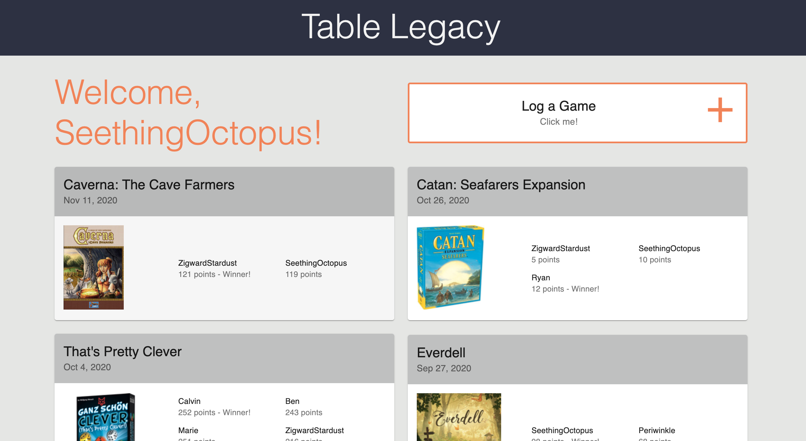
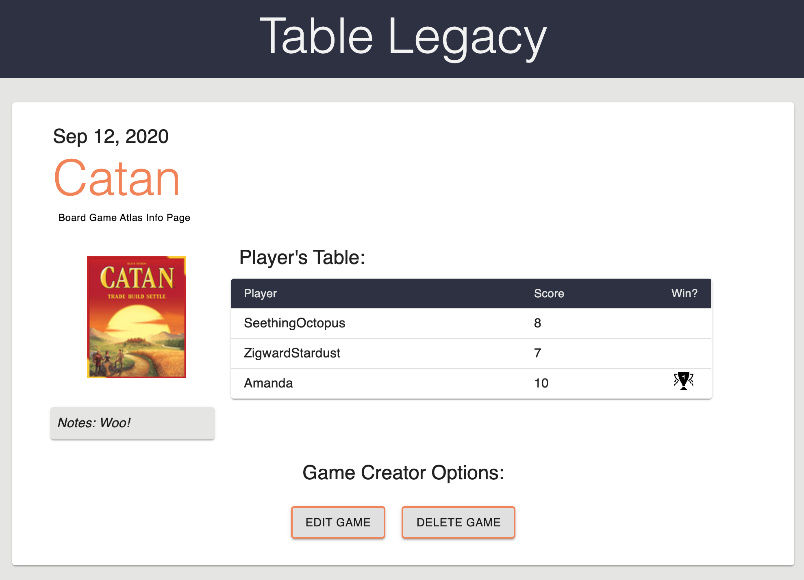

# Table Legacy
_Project Duration: 2 Week Sprint_

Table Legacy is a web app built to keep track of board game play history with your friends.  You can record the game played, who you played with, the scores, and the winner.  

Table Legacy makes it easy to keep track of your favorite games and helps you remind your friends who's better at Catan :smirk:

Deployed at https://tablelegacy.herokuapp.com/

## Screenshots





## Getting Started

These instructions will get you a copy of the project up and running on your local machine for development and testing purposes.

### Prerequisites 

- [Node.js](https://nodejs.org/en/)
- [PostrgeSQL](https://www.postgresql.org/)
- [Nodemon](https://nodemon.io/)

### Installing

1. Create a databse named 'table_legacy'.
2. The queries in the `database.sql` file are set up to create all the necessary tables and populate the needed data to allow the application to run correctly. The project is built on [Postgres](https://www.postgresql.org/download/), so you will need to make sure to have that installed. We recommend using Postico to run those queries as that was used to create the queries.
3. Open up your editor of choice and run an `npm install`
4. Run `npm run server` in your terminal
5. Run `npm run client` in your terminal
6. The `npm run client` command will open up a new browser tab for you!

### Creating the .ENV file

Create a `.env` file at the root of the project and paste this line into the file:
 ```
SERVER_SESSION_SECRET=**********************
REACT_APP_BGA_CLIENT_ID=***********************
```
First you will need to establish a SERVER_SESSION_SECRET to keep your application secure. Here's a site that can help you generate a secret: https://passwordsgenerator.net/. NOTE This secret should be more than 8 characters. Having a secret key that is less than 8 characters or leaving it as "superDuperSecret" will result in a warning from the app.
  
The board game info comes from [the Board Game Atlas API](https://www.boardgameatlas.com/api/docs/search).  Register an account to get access to the API.  The API has an initial limitation of 60 request per minute.

## Built With

* JavaScript
* Express
* React
* Redux
* Node.js
* Material-UI
* Moment.js
* postgreSQL
* Passport.js
* Board Game Atlas API

(A full list of dependencies can be found in package.json)

## Acknowledgement

Thanks to the folks at the Board Game Atlas API for having great documentation and a user friendly API.

## Support

If you have issues or suggestions, please email me at [dewitt.kane@gmail.com].
